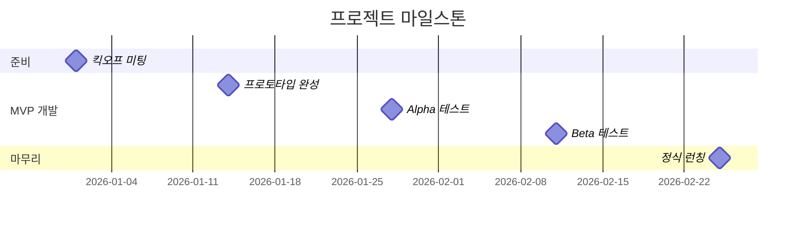

# 프로젝트 개요

## 프로젝트명과 한 줄 요약

**프로젝트명**: B0 (비제로) - 지하 0층

**한 줄 요약**: 숨겨진 지하 0층에서 출발하는 비행선을 타고 가상 세계를 여행하며 힐링과 자기성찰을 경험하는 온라인 커뮤니티

---

## Why - 왜 만드는가?

### 해결하려는 문제

현대인, 특히 20-30대 직장인들은 다음과 같은 어려움을 겪고 있습니다:

- 일상에서 벗어나 마음의 휴식을 취할 시간과 공간이 부족합니다
- 깊이 있는 대화를 나눌 기회가 적습니다
- 혼자서 자기성찰을 하기가 어렵습니다
- 온라인 커뮤니티는 피상적인 대화만 오가는 경우가 많습니다

### 우리의 접근

"여행"이라는 친숙한 은유를 통해 자연스럽게 힐링과 대화를 유도합니다. 마치 게스트하우스에서 여행자들이 만나 이야기를 나누듯, 온라인에서도 깊이 있는 대화가 가능한지 실험합니다.

### 팀의 목표

- ✅ **실제 사용 가능한 서비스 완성**: 단순한 아이디어가 아닌, 실제로 사람들이 사용할 수 있는 완성도 있는 서비스
- ✅ **가설 검증**: 게스트하우스 컨셉이 정말 대화를 유도할 수 있는지, 여행 컨셉이 몰입감을 주는지 데이터로 확인
- ✅ **빠른 실험**: 기능을 빠르게 추가하고 제거하며 사용자 반응에 따라 조정할 수 있는 유연한 구조
- ✅ **실제 사용자 확보**: SNS 광고를 통해 실제 사용자를 모집하고 피드백 수집

---

## Who - 누가 사용하는가?

### 주 타겟 사용자

**20-30대 직장인 중 힐링과 자기성찰이 필요한 사람들**

### 사용자 특성

| 특성        | 설명                           |
|-----------|------------------------------|
| 💼 직장인    | 주중에는 바쁘고, 주말이나 저녁 시간에 여유가 있음 |
| 😌 휴식 필요  | 일상에서 벗어나 마음의 휴식이 간절함         |
| 💭 대화 갈망  | 깊이 있는 대화를 원하지만 현실에서 기회가 부족함  |
| 🪞 자기성찰   | 자신의 감정과 생각을 정리하고 싶어 함        |
| 🌐 온라인 익숙 | 온라인 커뮤니티 경험이 있고 디지털 도구에 익숙함  |

### 사용자 페르소나 예시

**김서연 (28세, 마케터)**

- 평일 야근으로 지쳐있고, 주말에도 회복이 잘 안 됨
- 친구들과 만나도 피상적인 대화만 나누게 되어 답답함
- 일기를 쓰고 싶지만 혼자서는 작심삼일로 끝남
- 온라인에서 편하게 속마음을 털어놓을 수 있는 공간을 찾고 있음

---

## What - 무엇을 만드는가?

**지하 0층(B0)에서 출발하는 비행선을 타고 이세계를 여행하며 게스트하우스에서 사람들을 만나고, 자기성찰을 하는 온라인 커뮤니티 서비스**

### 핵심 컨셉

1. **지하 0층 발견**: 어느 날 방에서 발견한 신비한 핸드폰에 설치된 앱, B0 - 존재하지 않는 층으로의 초대
2. **비행선 터미널**: B0은 여러 이세계 도시로 가는 비행선이 출발하는 숨겨진 정류장
3. **가상 세계 여행**: 6개의 테마가 다른 도시를 비행선을 타고 여행합니다
4. **게스트하우스**: 각 도시의 게스트하우스에서 다른 여행자들을 만나 이야기를 나눕니다
    - **혼합형**: 정해진 시간에 함께하는 이벤트 중심 (불멍, 별멍 등)
    - **조용한 방**: 개인적인 대화와 자기성찰 중심 (No 파티)
5. **라운지**: 같은 게스트하우스 사람들과 1:1 대화를 나눌 수 있는 공간
6. **자기성찰**: 개인 숙소에서 일기를 쓰고, 질문에 답하며 자신을 돌아봅니다
7. **AI 호스트**: 친절한 호스트가 대화를 이끌고 이벤트를 진행합니다

### 차별화 포인트

- 🎭 **스토리와 세계관**: 단순한 채팅방이 아닌, 여행이라는 맥락 속에서 자연스러운 대화
- 🎈 **비행선 여행**: B0에서 출발하는 낭만적인 비행선 여행으로 몰입감 극대화
- 🌈 **도시별 테마**: 관계, 휴식, 사랑, 꿈, 성찰, 모험 등 다양한 주제로 깊이 있는 대화
- 🏠 **선택의 자유**: 혼합형/조용한 방 중 원하는 분위기의 게스트하우스 선택 가능
- 🤖 **AI의 도움**: 대화가 뜸할 때 자연스럽게 질문을 던지고 분위기를 이끄는 호스트
- 📝 **자기성찰 도구**: 일기, 문답지, 명상 등 혼자만의 시간도 의미 있게
- ✨ **판타지 요소**: 지하 0층, 비행선, 이세계 분위기로 현실에서 벗어난 몰입감

---

## When - 언제까지?

### 프로젝트 일정

| 항목           | 날짜/기간           |
|--------------|-----------------|
| **시작일**      | 킥오프 미팅 후 결정     |
| **완료일**      | 시작일로부터 8주 후     |
| **총 기간**     | 8주 (약 2개월)      |
| **주당 작업 시간** | 30시간 (팀원별 15시간) |
| **총 가용 시간**  | 240시간           |

### 마일스톤 요약

---

## Team - 팀 구성

### 팀원 정보

| 이름   | 역할      | 주요 기술   | 주당 시간 | 담당 영역    |
|------|---------|---------|-------|----------|
| 팀원 1 | 풀스택 개발자 | 웹 개발 전반 | 15시간  | 킥오프에서 결정 |
| 팀원 2 | 풀스택 개발자 | 웹 개발 전반 | 15시간  | 킥오프에서 결정 |

### 역할 분담 방식

**기능별 분담**을 기본 원칙으로 하며, 구체적인 배분은 킥오프 미팅에서 결정합니다.

**예상 분담 영역**:

**영역 A - 여행/이동 관련**:

- 시작 스토리
- 지도와 도시 선택 화면
- 비행선 티켓 구매 시스템
- 포인트 관리
- 이동 효과 (비행선 애니메이션)
- 시간 관리

**영역 B - 게스트하우스/소셜 관련**:

- 게스트하우스 입장 (유형 선택)
- 단체 대화방 (사랑방)
- 라운지 & 1:1 대화
- 대화 카드
- 감정 반응 기능
- 이벤트 관리
- AI 호스트

**공동 작업**:

- 개인 숙소 기능 (일기, 질문지, 명상)
- 사용자 프로필
- 기능 켜고 끄기 시스템
- 데이터 수집 및 분석
- 이미지 및 디자인
- 서버 설정

---

## References - 참고 서비스

### 벤치마킹 서비스

| 서비스              | 벤치마킹할 점     | 우리의 차별화                  |
|------------------|-------------|--------------------------|
| 🏠 **에어비앤비 체험**  | 테마별 공간 컨셉   | B0 비행선 터미널에서 출발하는 이세계 여행 |
| 💬 **게더타운**      | 공간 기반 소셜 경험 | 여행 스토리와 자기성찰 결합          |
| 📔 **하루 한 줄**    | 일기 작성 습관화   | 도시별 맥락과 함께 제공            |
| 🎲 **위버스**       | 팬 커뮤니티 소속감  | 여행자라는 정체성, 테마별 도시        |
| 🗨️ **디스코드**     | 채널 기반 대화    | 시간 기반 이벤트, AI 호스트        |
| 🎮 **하늘: 빛의 아이** | 감성적 온라인 경험  | B0, 비행선 여행, 판타지 세계관      |

---